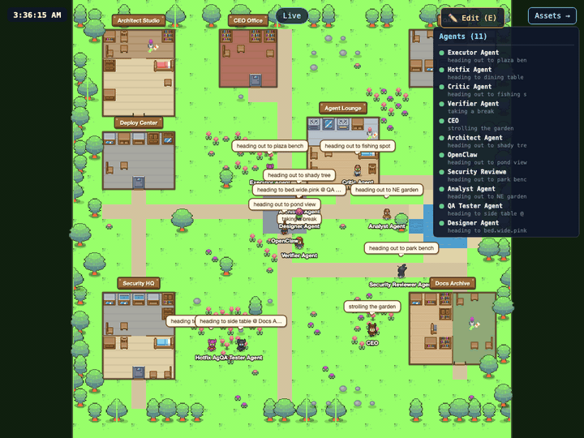
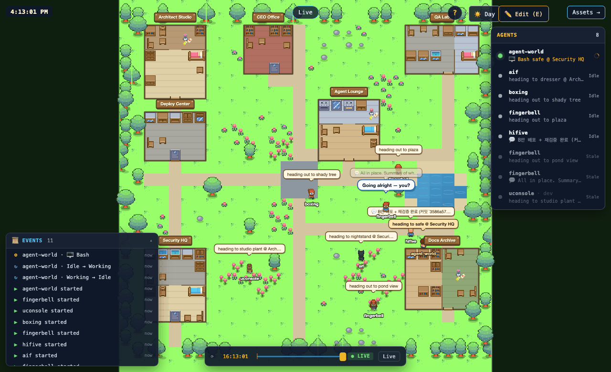
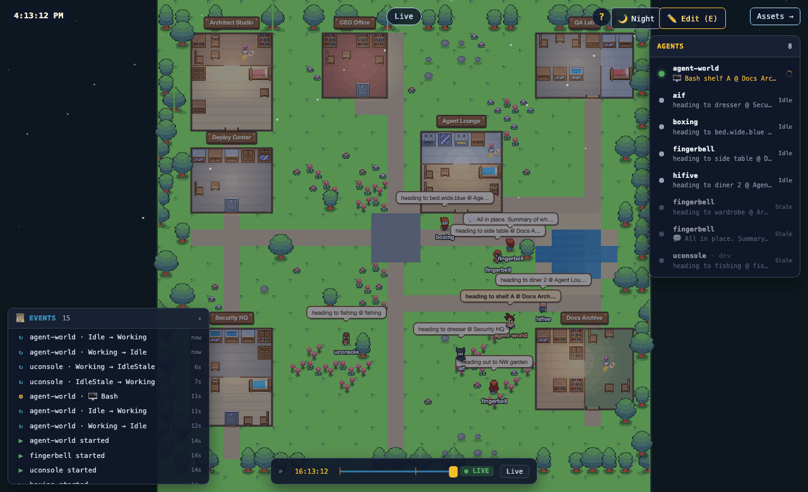
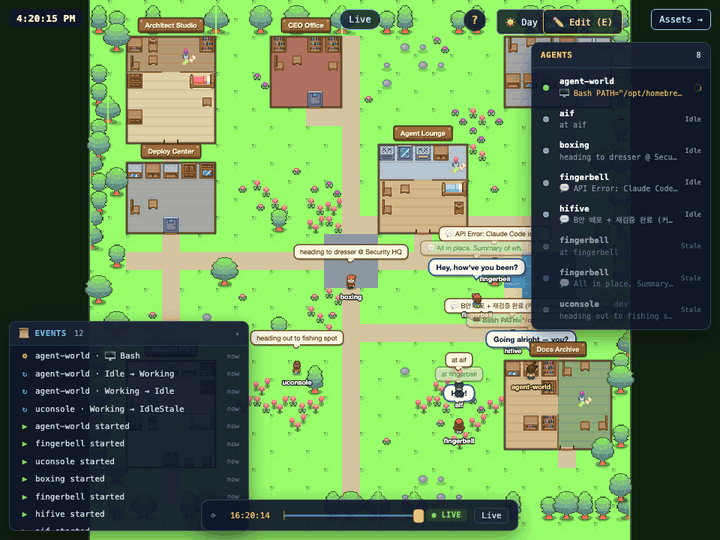
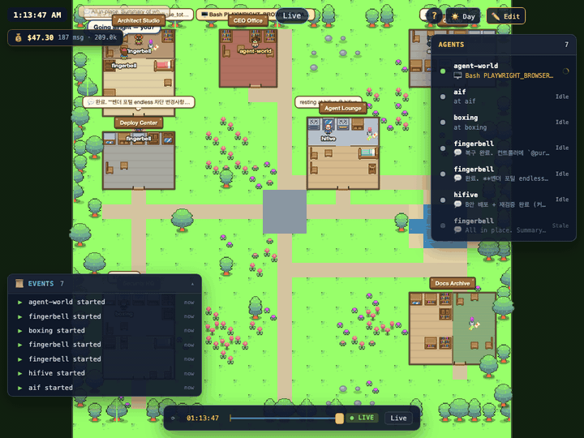
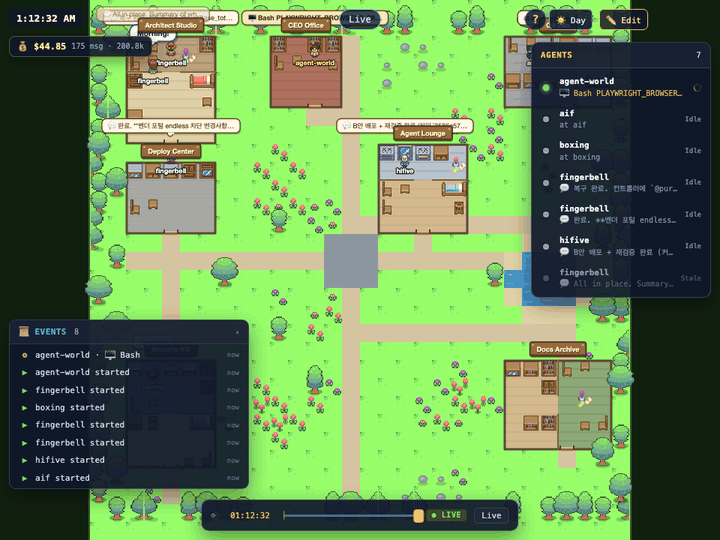
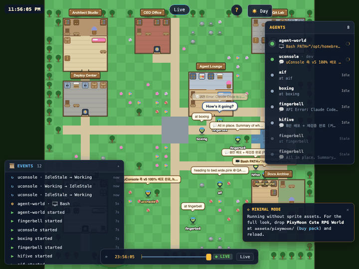

# Agent World

A spatial, RPG-style visualizer for **live Claude Code CLI sessions on your
Mac**. Every running `claude` process becomes a sprite walking a 30×30
village; every repo becomes a building; permission prompts line up as a
literal queue at the info desk; tool invocations rain emoji overhead.



Inspired by **Park et al., "Generative Agents: Interactive Simulacra of
Human Behavior"** ([paper](https://arxiv.org/abs/2304.03442) ·
[original repo](https://github.com/joonspk-research/generative_agents))
and by [**claude-control**](https://github.com/sverrirsig/claude-control)
(from which the discovery model — `ps` + `lsof` + hook files, no database
— is borrowed).


---

## What you get

### The world

- **Zero-dep start** — `npm install && npm start` and you have a working
  village. No paid asset pack required; optional PixyMoon upgrade path.
- **Live session map** — every `claude` process on this Mac renders as a
  sprite with smooth sub-tile interpolation. Repo = building; cwd = desk.
  Walks to exit and fades on `SessionEnd`.
- **Status-driven routing** — `Working` → sit at a desk; `Waiting`
  (permission prompt) → join the info-desk queue with a pulsing amber
  halo; `Errored` → wander to the tavern; `Idle` → wander near your
  building; `Finished` → walk to exit + fade.
- **Tool icons overhead** — `Bash 🖥 · Edit/Write ✏ · Read 📖 · Grep 🔎 ·
  Task 👥 · WebFetch 🌐`. A floating **pop emote** animates on every new
  tool invocation; the steady icon cross-fades underneath.
- **Productivity burst glow** — when a session fires ≥3 Edit/Write calls
  within 10 s, its shadow turns warm gold and a soft outer ring glows
  for 4 s. Makes "Claude just wrote 8 files" visually obvious.
- **Status-transition poof** — short white radial burst on meaningful
  changes (Waiting→Working, entering/leaving Errored, Idle→Working, →Finished).
- **Animated "thinking" dots** when the session is Working but has no
  tool active. Cycles `.` `..` `...` in the activity bubble — no extra layer.
- **Git branch → hat hue** — sessions on the same branch cluster visually.
- **Day / Night / Live clock** — sky overlay interpolates across real
  time. At night, **warm window glow** spills from every building
  interior (30 % flicker like wood lamps).

 

### Watching + interacting



- **DOM agent roster** (top-right) — clickable rows with a working
  spinner on Working sessions. Hover highlights; selection follows
  sprite + hotkey selection. Auto-collapses on ≤900 px viewports.
- **Sprite / building hover tooltip** — cursor-following DOM tooltip
  with status, tool, cwd, branch (for sprites) or active sessions
  inside (for buildings). Shares hit-test radius with click so the
  highlight ring and click target never diverge.
- **DOM session detail panel** — click a sprite or roster row; panel
  shows repo, branch, model, tool, last assistant message, per-session
  token/USD cost, plus buttons to open the transcript / Live PTY and
  focus the host terminal.
- **In-browser TUI** — the panel's "💬 View conversation" opens a
  full-screen xterm view. `📜 Transcript` tab tails the JSONL in 1.5 s
  polls; `🎛 Live` tab attaches a live PTY (bilingual non-blocking
  confirm before spawning a parallel `claude --resume`).
- **💰 World budget badge** (top-left) — live USD + token counter for
  everything running on this Mac. Click to open a popover with
  per-session breakdown sorted by cost. Computed from
  `assistant.usage` in each transcript JSONL against per-model
  Anthropic pricing (Opus / Sonnet / Haiku; input, output,
  cache-write, cache-read billed separately). Cold-start caps the
  historical scan at 1.5 MB per session so startup never stalls.

  

- **🔒 Interactive permission approval** — when the optional
  PreToolUse hook is installed (`npm run install-hooks -- --apply`),
  Claude blocks on permission prompts; Agent World catches the request
  via its hook plugin and renders an **Allow / Deny / Focus Terminal**
  toast in the browser. Decisions round-trip back to the CLI in
  <100 ms. Desktop notifications fire the first time the tab is
  backgrounded (requires user-gesture permission).
  Without the hook, the toast still appears in a read-only fallback
  mode (session detected as `Waiting`, shows "Focus Terminal" only) so
  you at least know what's blocking.

  

- **Event log** (bottom-left, collapsible) — streams session starts,
  status changes, tool invocations, session ends. Click a row to
  select that agent. Last 80 entries, relative timestamps (`now`,
  `12s`, `3m`). Hides on ≤600 px viewports so the world stays
  viewable on phones.
- **Timeline scrubber** (bottom-center) — 1 Hz client-side snapshot
  ring buffer (~60 s window). Drag the thumb to freeze the world on a
  past frame, release or press Space to return to live. Shows absolute
  clock + `● LIVE` / `⏸ PAUSED` badge.
- **Permission queue as a literal line** at the plaza — depth
  visualizes approval debt.
- **Stabilized speech bubbles** — each sprite's activity bubble has
  priority-ordered state (`Waiting` > `Errored` > active tool >
  recent assistant snippet > station > empty) with a 2.5 s minimum
  dwell on lower-priority downgrades. Higher-priority events preempt
  immediately. Fixes the "flickering text" from mixed event sources.
- **Help overlay** (`?`) — bilingual (en + ko) shortcut legend. Button
  top-right, `?` or `Shift+/` toggles. ESC to close.

### Keyboard

| Key | Action |
|-----|--------|
| `?` | Open / close shortcut legend |
| `1`–`9` | Focus session #N |
| `0` | Close session panel |
| `Esc` | Close panels + modals |
| `T` | Open transcript viewer (session selected) |
| `L` | Switch to Live PTY tab |
| `N` | Toggle persistent name-tags (names always show on hover / selection) |
| `M` | Toggle minimal-mode preview (procedural sprites even when pack is installed) |
| `←` `→` | Scrub timeline ±1 s |
| `Space` | Play / pause timeline |
| `E` | Toggle world editor |
| `Ctrl-Z` / `Ctrl-S` / arrows / `F` | Editor undo / save / nudge / flip |

---

## Quick start

```bash
# 1) install deps
npm install

# 2) start the server
export AGENT_WORLD_API_TOKEN=$(openssl rand -hex 16)
npm start

# 3) open http://localhost:3102
```

No assets required — runs in **minimal mode** with procedural sprites
(fallback furniture, trees, flowers, hat-coloured avatars). A banner
in the bottom-right explains how to upgrade.



### Optional: upgrade to the PixyMoon look

Buy **PixyMoon Cute RPG World** from
[pixymoon.itch.io](https://pixymoon.itch.io/cute-rpg-world) and drop
the extracted pack under `assets/pixymoon/Cute RPG World/`. The
server picks it up automatically on the next reload — minimal mode
banner disappears, the Assets Manager and World Editor light up, and
all 50+ furniture sprites render as pixel art.

The PixyMoon pack is **not included** in this repo (per their license
you must purchase your own copy). See [`assets/pixymoon/README.md`](assets/pixymoon/README.md).

The server reads:

- `~/.claude/sessions/<pid>.json` — live session metadata
- `~/.claude-control/events/<pid>.json` — hook events if claude-control is installed
- `~/.claude/plugins/agent-world/events/<pid>.jsonl` — hook events from our own plugin (opt-in)
- `~/.claude/projects/<encoded-cwd>/<sessionId>.jsonl` — transcript tails on demand

If you don't have claude-control, install our hooks (additive, doesn't
touch `~/.claude/settings.json`):

```bash
npm run install-hooks            # dry-run, prints the plan
npm run install-hooks -- --apply # actually write plugin + hook scripts
```

Installs three scripts under `~/.claude/plugins/agent-world/`:

- **Status hooks** (`SessionStart`, `UserPromptSubmit`, `Stop`,
  `PostToolUse`, `SessionEnd`, `SubagentStart`, `SubagentStop`) —
  async, append JSONL breadcrumbs the snapshotter reads.
- **PreToolUse hook** — synchronous (`async: false`); POSTs the pending
  tool call to `/api/hooks/permission-request` and waits up to 92 s
  for a browser click. On `allow`/`deny` the CLI follows Agent World's
  decision; on `ask`/timeout/error the CLI falls through to its own
  built-in prompt, so the hook is always safe to have installed.

Without the PreToolUse hook, the browser still shows a read-only
"Focus Terminal" fallback toast whenever a session enters `Waiting`,
so you at least get the notification.

---

## Routes

| Method / path | Purpose |
| --- | --- |
| `GET /state` | Full world state (authoritative snapshot on WS connect) |
| `GET /healthz` | Snapshot: sessionsObserved, buildings/tents, uptime, memMB |
| `GET /api/sessions` | List of live Claude sessions |
| `GET /api/sessions/:sessionId` | Per-session detail + transcript preview + cost |
| `POST /api/sessions/:sessionId/focus` | Focus the terminal tab (tmux / iTerm / Terminal.app) |
| `GET /api/cost` | World totals + per-session breakdown (tokens, USD, model) |
| `POST /api/hooks/permission-request` | **Localhost only.** PreToolUse hook endpoint — blocks until browser decides |
| `GET /api/permissions/pending` | List in-flight permission requests (used for browser hydration on reconnect) |
| `POST /api/permissions/:requestId/decide` | `{decision: "allow"\|"deny"\|"ask", reason?}` — resolves the pending hook call |
| `GET /api/world/layout` · `PUT /api/world/layout` | World layout edits |
| `WS /` | State snapshot + debounced `patch` messages + `permission-request` / `permission-resolved` push |
| `POST /sync/paperclip*` | `410 Gone` — see `legacy/paperclip/README.md` |

---

## Project structure

| Package | Purpose |
| --- | --- |
| `adapter/worldModel.js` | Pure world geometry (buildings, stations, tiles). Shared. |
| `adapter/claudeAdapter.js` | Session snapshot → world-agent state + intent-tagged destination. |
| `server/claudeSnapshotter.js` | 1 Hz poller: `ps` + `lsof` + hook events + session JSON. |
| `server/sessionStatus.js` | Pure classifier (hook events + mtime + CPU → status). |
| `server/repoRoot.js` | `git rev-parse --show-toplevel` cache, worktree-aware. |
| `server/transcriptPreview.js` | On-demand JSONL tail reader (no permanent fd). |
| `server/buildingAssignments.js` | Repo → building mapping, persisted. |
| `server/stateDiffBroadcast.js` | Debounced WS broadcast + JSON Merge Patch. |
| `server/terminalFocus.js` | Focus terminal by pid (tmux, iTerm, Terminal.app). |
| `server/ptyServer.js` | Live PTY manager for in-browser Claude sessions (spawns `claude --resume` only; cwd-guarded, one attach per session). |
| `server/hookPluginInstaller.js` | Additive hook plugin under `~/.claude/plugins/agent-world/`. Includes PreToolUse sync hook. |
| `server/permissionStore.js` | Pending PreToolUse request store — promise-per-request, 90 s timeout, 50-request cap, WS fanout on change. |
| `server/costTracker.js` | Forward-only JSONL scanner (inode + size + mtime for rotation detection). Bills each `assistant.usage` block against per-model Anthropic pricing. |
| `frontend/avatarRuntime.mjs` | Client-side intent-aware A* pathing, sub-tile lerp, tool-pop / poof / productivity-burst visual channels. Bubble dwell stabilizer. |
| `frontend/fallbackSprites.js` | Procedural furniture / flora / avatar renderers used when the PixyMoon pack isn't installed. |
| `frontend/components/AssetsStatusBanner.js` | "Minimal mode" banner + gating for Assets link + Editor toggle when sprites are missing. |
| `frontend/components/WorldMap.js` | Canvas renderer + hover hit-test + scrub snapshot support. |
| `frontend/components/SessionDetailPanel.js` | DOM sidebar for clicked agent — adds cost + model line. |
| `frontend/components/TerminalTuiView.js` | Full-screen transcript + Live PTY viewer (xterm.js). |
| `frontend/components/AgentRoster.js` | DOM roster of live sessions — clickable, spinner on Working. |
| `frontend/components/HelpOverlay.js` | "?" button + bilingual shortcut legend. |
| `frontend/components/HistoryBuffer.js` | 1 Hz client-side snapshot ring (60 s) + derived event stream. |
| `frontend/components/EventLog.js` | Collapsible bottom-left panel streaming history events. |
| `frontend/components/TimelineScrubber.js` | Bottom-center draggable scrubber backed by HistoryBuffer. |
| `frontend/components/PermissionToast.js` | Top-right Allow/Deny/Focus toast stack. Subscribes to WS `permission-request` + `permission-resolved`. Hydrates pending on boot. Desktop notifications. Fallback toast when hook isn't installed. |
| `frontend/components/WorldBudgetBadge.js` | Top-left 💰 badge — polls `/api/cost` every 5 s, opens per-session popover on click. |
| `frontend/vendor/` | Vendored `@xterm/xterm` + `addon-fit` (no CDN dependency). |
| `legacy/paperclip/` | Archived Paperclip integration (see its README). |

---

## Configuration

### Authentication

API/WebSocket auth is required by default:

```bash
export AGENT_WORLD_API_TOKEN='<strong-token>'
```

The token is passed via `Authorization: Bearer …` for HTTP and issued as
a short-lived one-shot ticket for WebSocket upgrades
(`POST /auth/ws-ticket`, 15s TTL).

### Environment variables

| Variable | Default | Purpose |
| --- | --- | --- |
| `PORT` | `3102` | HTTP/WS listen port |
| `AGENT_WORLD_API_TOKEN` | _required_ | Bearer token for auth-protected endpoints |
| `AGENT_WORLD_CORS_ALLOWED_ORIGINS` | (same-origin only) | Comma-separated allowlist |
| `AGENT_WORLD_RATE_LIMIT_WINDOW_MS` | `60000` | Fixed-window rate-limit window |
| `AGENT_WORLD_RATE_LIMIT_MAX_REQUESTS` | `120` | Requests per client per window |
| `AGENT_WORLD_WS_TICKET_TTL_MS` | `15000` | WS ticket TTL |
| `AGENT_WORLD_PERMISSION_TIMEOUT_MS` | `90000` | How long the PreToolUse hook waits for a browser click before resolving `ask` (falls through to CLI prompt) |

### Behind a reverse proxy / tunnel (FRP, nginx, Cloudflare)

`app.set('trust proxy', true)` and WS heartbeats are built-in. WS URL is
derived from `window.location.origin`.

---

## Tests

```bash
npm run test:unit          # 112 tests — no network
npm run test:request       # 16  — request-level HTTP/WS
npm run test:integration   # 13  — server / snapshotter / PTY
npm run test:e2e           # 5   — playwright smoke + browser assertions
npm run test:smoke         # everything above (146 total)
npm run test:legacy        # 27  — archived Paperclip tests (gated)
```

### Headless probes

Helper probes verify the UI end-to-end against a running server
(defaults to `PORT=3199`, `AGENT_WORLD_API_TOKEN=smoke`):

```bash
PLAYWRIGHT_BROWSERS_PATH=~/.cache/agent-world-playwright \
  PORT=3199 AGENT_WORLD_API_TOKEN=smoke \
  node test/helpers/browser-probe.mjs             # world + transcript + Live PTY

PLAYWRIGHT_BROWSERS_PATH=~/.cache/agent-world-playwright \
  PORT=3199 AGENT_WORLD_API_TOKEN=smoke \
  node test/helpers/browser-probe-ux.mjs          # roster + hover + help + log + scrubber

PLAYWRIGHT_BROWSERS_PATH=~/.cache/agent-world-playwright \
  PORT=3199 AGENT_WORLD_API_TOKEN=smoke \
  node test/helpers/browser-probe-overlap.mjs     # asserts top-row buttons don't overlap

PLAYWRIGHT_BROWSERS_PATH=~/.cache/agent-world-playwright \
  PORT=3199 AGENT_WORLD_API_TOKEN=smoke \
  node test/helpers/browser-probe-cost.mjs        # 💰 badge + popover

PLAYWRIGHT_BROWSERS_PATH=~/.cache/agent-world-playwright \
  PORT=3199 AGENT_WORLD_API_TOKEN=smoke \
  node test/helpers/browser-probe-permission.mjs  # fake hook → toast → click Allow → hook response
```

### Demo capture

GIFs in `demo/` are generated by `scripts/capture-frames.mjs`. Requires
`ffmpeg` on `PATH` (via Homebrew on macOS: `brew install ffmpeg`).
`cost` and `permission` additionally need `AGENT_WORLD_API_TOKEN` set
to whatever the server was started with.

```bash
PATH="/opt/homebrew/bin:$PATH" \
  node scripts/capture-frames.mjs world      http://127.0.0.1:3102
node scripts/capture-frames.mjs editor     http://127.0.0.1:3102
node scripts/capture-frames.mjs ux         http://127.0.0.1:3102
node scripts/capture-frames.mjs assets     http://127.0.0.1:3102
node scripts/capture-frames.mjs minimal    http://127.0.0.1:3102  # on a PixyMoon-less server
AGENT_WORLD_API_TOKEN=<token> \
  node scripts/capture-frames.mjs cost       http://127.0.0.1:3102
AGENT_WORLD_API_TOKEN=<token> \
  node scripts/capture-frames.mjs permission http://127.0.0.1:3102
```

---

## Development daemon (macOS launchd)

```bash
npm run daemon:install
npm run daemon:restart
npm run daemon:status
npm run daemon:logs
npm run daemon:uninstall
```

Logs: `logs/agent-world.{stdout,stderr}.log`.

---

## Credits

### Assets — PixyMoon (optional)

When available, the tile sets and character sprites come from the
**2D Topdown Cute RPG World** pack by
[**PixyMoon**](https://pixymoon.itch.io/cute-rpg-world). Assets are
**not** included in this repository; buy the pack and drop it under
`assets/pixymoon/Cute RPG World/` (see
[`assets/pixymoon/README.md`](assets/pixymoon/README.md)).

Without the pack, `frontend/fallbackSprites.js` renders procedural
substitutes for furniture, flora, and avatars so the app still runs.

Per the PixyMoon license: usable in personal and commercial projects;
modification allowed; credits to PixyMoon required; cannot be resold.

### Inspiration

- Park et al., **"Generative Agents: Interactive Simulacra of Human
  Behavior"** — [arXiv:2304.03442](https://arxiv.org/abs/2304.03442),
  [code](https://github.com/joonspk-research/generative_agents).
- [**claude-control**](https://github.com/sverrirsig/claude-control) —
  session discovery model (`ps`, `lsof`, hook files, no database).

---

## License

Agent World's own code is MIT (see `LICENSE`). Third-party assets retain
their original licenses; you are responsible for complying with them.
